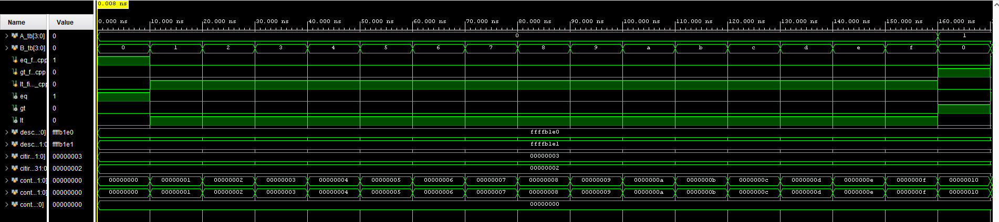
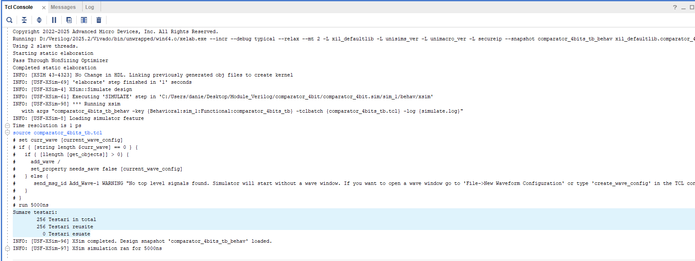

#         Creating and Autotesting an 4-bit Magnitude Comparator
##      Project Overview ##
This project features a structured 4-bit Comparator designed in Verilog. Beyond just physical design, the project involves an automated testing environment that integrates an C++ "Golden Model" and a Python-generated script that ensures all possible combinations.

##      Features ##

### Verilog Design

* Built using 1-bit comparator modules.

### Automated Testbench

* Reading and writing is automated using external files.

## Combination of multiple programming languages ##

* ## Python

* Automatically generates and .txt file with all test cases.

* ## C++

* Generates safe results for later comparison.

* ## Verilog

* Generates hardware logic and compares it with C++ tests in real-time.

## Project Structure ##

|Folder/File| Description |
|:----------|:------------|
| `src` | Contains all hardware circuits needed for project.|
| `cpp_model` | Contains c++ source code for generating "Golden Model".|
| `scripts` | Contains python source code for generating all needed inputs.|
| `data` | Contains all the necessary text folders used during simulation.|

## How to Run:

* ### Generating inputs file:
Run the python script(`script.py`) to generate all the required inputs

* ### Golden Model:
Run the c++ code(`comparator.cpp`) to generate 2 files: `rezultate_usor_de_citit` that are easier to read and `rezultate_asteptate` that are used for testing Verilog code.

* ### Vivado Simulation:

* Open Vivado Xilinx and create a new project.
* Add the `.v` files as sources.
* `Note`:Because we have 256 cases and 10 time-units each(mostly nano-seconds), implicit duration-time of Vivado simulation won't be enough.To fix this: In vivado, on the left-side Right click on Simulation -> Simulation Settings -> Simulation -> xsim.simulate.runtime -> set to a higher value(ex:3000ns). For image guides go to `guide_images` folder.

* ### Results:

* By click-ing `Run Simulation` in vivado,  the testbench will automatically read all the necessary data and execute the code. The results will be displays in the Tcl Console, as well as the waveforms.

